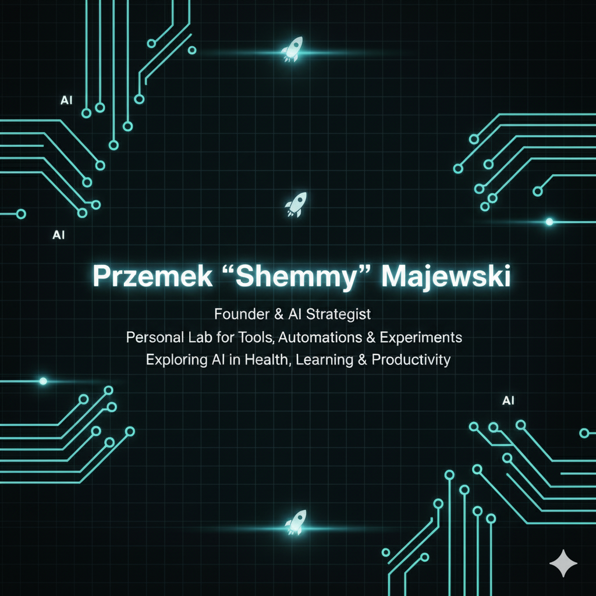

<!--
✨ Special GitHub Profile README for przemmaj ✨
-->

  

# 👋 Hi, I’m Przemek “Shemmy” Majewski  

**Founder & AI Strategist • CEO @ [DLabs.AI](https://dlabs.ai)**  
*Personal lab of tools, automations & experiments that make work smarter and life easier — exploring AI in health, learning, and productivity.*

📍 Gdańsk, Poland | ✉️ shemmy@dlabs.ai | [LinkedIn](https://pl.linkedin.com/in/shemmy-majewski) | [Twitter](https://twitter.com/przemmaj)

---

### 🧠 About Me

I’m a founder who still loves to build.  
Most of my work lives in private repos at [DLabs.AI](https://dlabs.ai),  
but this GitHub is my **personal playground** — a space for small tools, prototypes,  
and experiments that make my daily work faster, smarter, or just more fun.

I’m particularly interested in how **AI can improve learning and health**,  
and how data-driven design can help people work — and live — more intelligently.

---

### 🧩 Featured Projects

*Coming soon — personal tools and experiments I’ll be sharing publicly.*

<!--
| Project | Description |
|:--|:--|
| [Prompt Manager](https://github.com/przemmaj/prompt-manager) | A lightweight system for managing and versioning GPT prompts — helping AI teams stay consistent and productive. |
| [AI Product Blueprint Tools](https://github.com/przemmaj/ai-blueprint-tools) | Scripts and templates supporting DLabs.AI’s AI product design process. |
| [LearningOps](https://github.com/przemmaj/learningops) | Experiments around AI in education — from personalized learning flows to knowledge extraction. |
| [Health Insights Lab](https://github.com/przemmaj/health-insights-lab) | Early prototypes connecting diet, glucose data, and behavioral change — inspired by Suguard. |
-->

---

### ⚙️ My Toolbox

**Languages**  

<!--

-->

**Frameworks & Tools**  

<!--

-->

**Automation & Ops**  

---

### 🌍 Beyond Code

When I’m not building, you’ll find me out on **gravel or MTB trails across Poland**,  
or experimenting with ways to live longer, healthier, and more consciously.  

> *“Build things that make learning and health more intelligent.”*

---

<!--
Notes for future updates:
- Add header image (assets/header.png)
- Add links once key repos go public
- Optional: restore GitHub stats or badges
-->
